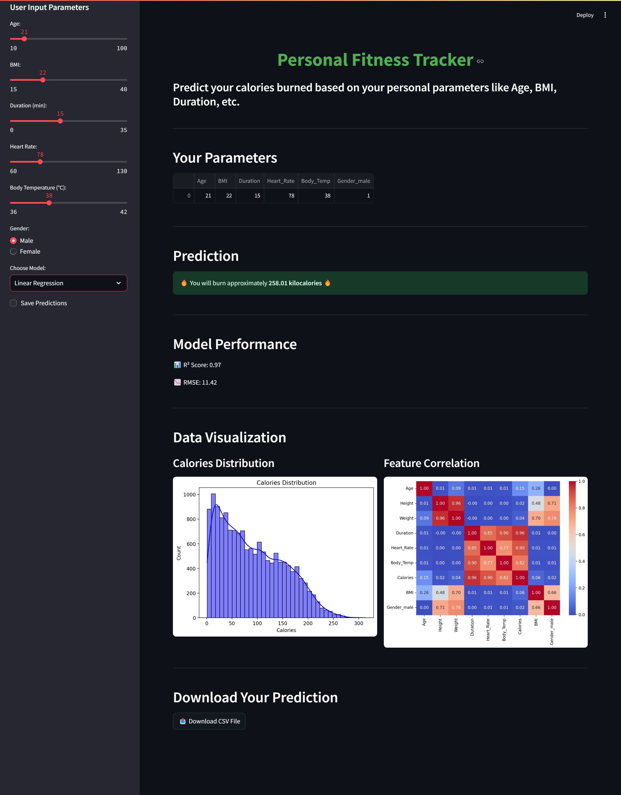

# 🏋️‍♂️ Fitness Tracker Project  

🔗 GitHub Repository: https://github.com/Sharath-Soma/Implementation-of-Personal-Fitness-Tracker-using-Python

⭐ GitHub Stars: https://github.com/Sharath-Soma/Implementation-of-Personal-Fitness-Tracker-using-Python/stargazers

🔀 GitHub Forks: https://github.com/Sharath-Soma/Implementation-of-Personal-Fitness-Tracker-using-Python/network

🐛 GitHub Issues: https://github.com/Sharath-Soma/Implementation-of-Personal-Fitness-Tracker-using-Python/issues

📜 License: https://github.com/Sharath-Soma/Implementation-of-Personal-Fitness-Tracker-using-Python/blob/main/LICENSE

🚀 **Try it now!**  
Click the button below to open the Jupyter Notebook:  

📌 Overview
The Personal Fitness Tracker is a machine learning-powered calorie prediction application that helps users track their fitness progress based on biometric and activity data. It provides personalized insights into calorie expenditure using Linear Regression and Random Forest models.

🚀 Key Features:
✅ Predicts calories burned based on Age, BMI, Duration, Heart Rate, and Body Temperature
✅ Supports two ML models – Linear Regression & Random Forest
✅ Interactive Data Visualizations – Histograms & Heatmaps
✅ User-friendly Streamlit UI for real-time predictions
✅ Downloadable CSV reports for predictions
✅ Customizable Model Selection

## 🛠️ Tech Stack  

| Technology      | Description |
|---------------|------------|
| **Python** 🐍 | Core programming language for model implementation |
| **Streamlit** 🎨 | Used for building the interactive web-based UI |
| **Scikit-Learn** 🤖 | Machine learning models for calorie prediction |
| **Pandas** 📊 | Data handling and preprocessing |
| **Matplotlib** 📈 | Visualization of calorie distribution |
| **Seaborn** 🔥 | Heatmaps and statistical data visualizations |

📊 Project Workflow
1️⃣ Data Collection 📂

Uses calories.csv & exercise.csv datasets.
Merges & processes exercise and calorie data.
2️⃣ Feature Engineering 🔬

Calculates BMI from Height & Weight.
Encodes categorical variables (Gender).
3️⃣ Model Selection & Training 🏋️‍♂️

Random Forest Regressor (Higher accuracy, non-linear relationships).
Linear Regression (Interpretable and efficient).
4️⃣ Real-time Prediction & Visualization 📈

Predicts calorie burn based on user input.
Displays correlation heatmaps & calories distribution graphs.
5️⃣ User Interaction & Download 📥

Users can save & download predictions.
💻 Installation & Usage
🔧 Prerequisites
Ensure you have Python 3.9+ and the required libraries installed.

bash
Copy
Edit
pip install streamlit pandas numpy scikit-learn matplotlib seaborn
🚀 Running the Application
Run the Streamlit app using:

bash
Copy
Edit
streamlit run app.py

## 📷 Screenshots  

### 🔹 Linear Regression
  

### 🔹 Random Forest 
  

📜 Code Structure
bash
Copy
Edit
📂 Personal-Fitness-Tracker/
│── 📜 App.py               # Main Streamlit Application  
│── 📜 calories.csv         # Calorie dataset  
│── 📜 exercise.csv         # Exercise dataset  
│── 📂 Output_Images/       # Contains Output Images  
│── 📜 README.md            # Project Documentation  
📢 Future Enhancements
🔹 Add deep learning-based models for improved accuracy.
🔹 Implement user authentication & history tracking.
🔹 Extend to mobile app integration.

## 👨‍💻 Author  

📌   

If you find this project useful, ⭐ Star this repository! 🚀  
